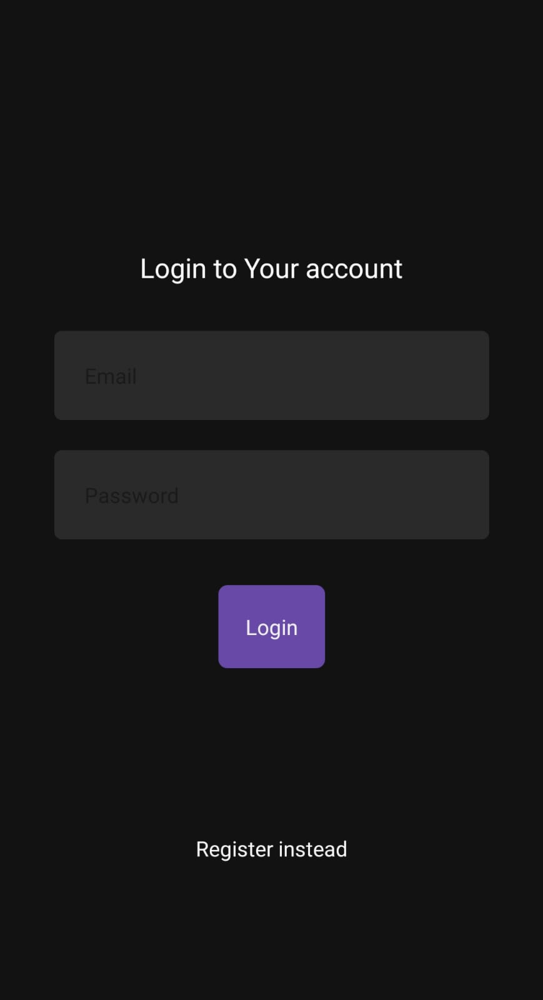
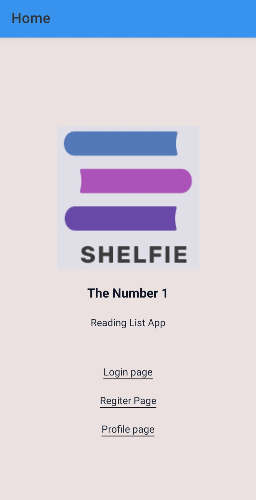
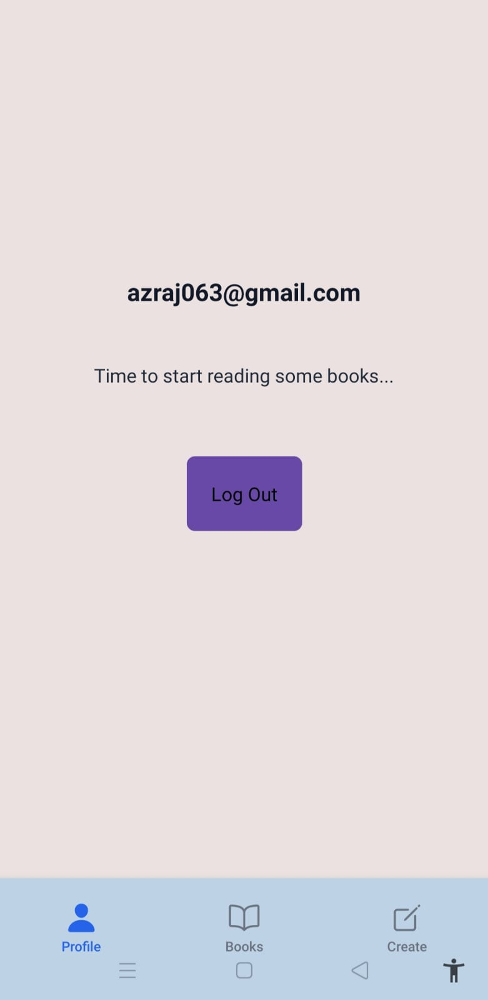
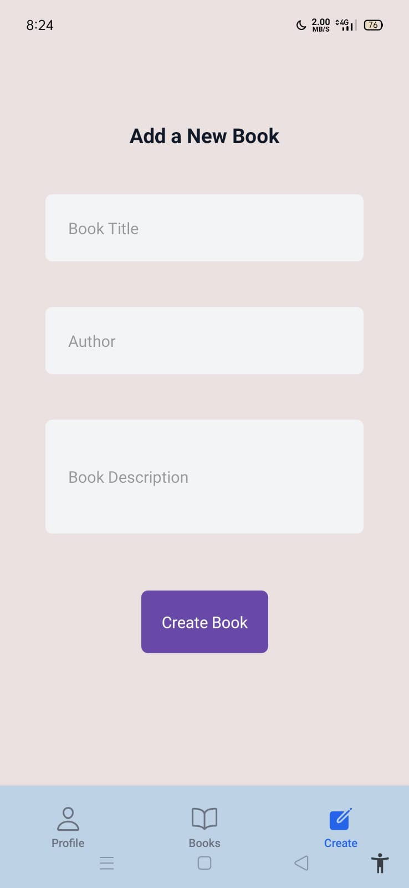
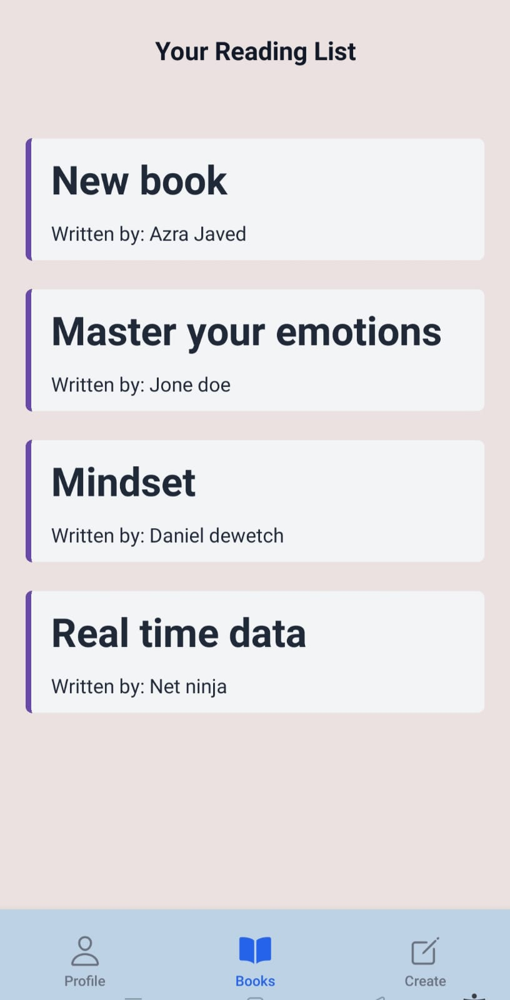
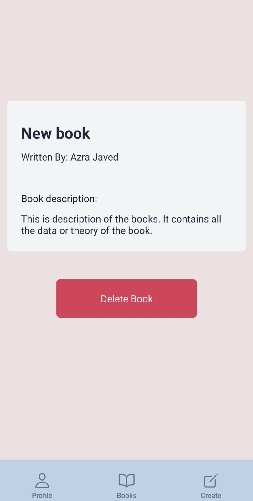

# 📚 React Native Learning Notes


---

# Core React Native Components

## 1. View

### What is it?

`View` is the most fundamental component in React Native. It acts like a `<div>` in HTML and is used to group and organize other components.

### Common Uses

* Creating layouts
* Wrapping other components
* Applying styles
* Organizing the UI

### Example

```jsx
<View>
    <Text>Hello World</Text>
</View>
```

---

## 2. Text

### What is it?

`Text` is used to display text on the screen.

Unlike React for the web, **every piece of text in React Native must be inside a `<Text>` component.**

### Common Uses

* Titles
* Paragraphs
* Labels
* Button text

### Example

```jsx
<Text>Hello React Native</Text>
```

---

## 3. TextInput

### What is it?

`TextInput` allows users to enter text.

### Common Properties

| Property        | Purpose          |
| --------------- | ---------------- |
| value           | Current value    |
| onChangeText    | Updates state    |
| placeholder     | Placeholder text |
| secureTextEntry | Password field   |
| multiline       | Multiple lines   |

### Example

```jsx
<TextInput
    placeholder="Book Title"
    value={title}
    onChangeText={setTitle}
/>
```

---

## 4. Button

React Native provides a built-in `Button`, but it has limited styling options.

For custom designs, developers commonly use:

* Pressable
* TouchableOpacity
* TouchableHighlight

---

## 5. Pressable

### What is it?

`Pressable` detects user interactions such as taps and long presses.

It is the recommended touch component for modern React Native applications.

### Common Uses

* Cards
* Buttons
* Navigation
* Interactive UI

### Example

```jsx
<Pressable onPress={handlePress}>
    <Text>Open Book</Text>
</Pressable>
```

---

## 6. TouchableWithoutFeedback

### What is it?

A touchable component that performs an action without showing any visual feedback.

### Common Use

Dismissing the keyboard.

```jsx
<TouchableWithoutFeedback
    onPress={Keyboard.dismiss}
>
    ...
</TouchableWithoutFeedback>
```

---

## 7. FlatList

### What is it?

`FlatList` efficiently renders lists by displaying only the items visible on the screen.

It is much more performant than using `.map()` for long lists.

### Important Props

| Prop                   | Description               |
| ---------------------- | ------------------------- |
| data                   | Array to display          |
| renderItem             | Renders each item         |
| keyExtractor           | Unique key for each item  |
| ListEmptyComponent     | Shown when list is empty  |
| ItemSeparatorComponent | Separator between items   |
| contentContainerStyle  | Styles the list container |

### Example

```jsx
<FlatList
    data={books}
    keyExtractor={(item) => item.$id}
    renderItem={({ item }) => (
        <Text>{item.title}</Text>
    )}
/>
```

---

## 8. ActivityIndicator

### What is it?

Displays a loading spinner while data is being fetched.

### Example

```jsx
<ActivityIndicator
    size="large"
    color="blue"
/>
```

---

## 9. Keyboard

The `Keyboard` API allows you to control the device keyboard.

### Common Functions

```jsx
Keyboard.dismiss()
```

Used to hide the keyboard after form submission or when tapping outside the input.

---

## 10. StyleSheet

### What is it?

`StyleSheet` organizes component styles and improves readability.

### Example

```jsx
const styles = StyleSheet.create({
    container:{
        flex:1,
        justifyContent:"center"
    }
});
```

---

# React Hooks

---

## useState()

### Purpose

Stores and updates local component state.

### Syntax

```jsx
const [title, setTitle] = useState("");
```

Whenever the state changes, the component automatically re-renders.

### Common Uses

* Form fields
* Loading states
* Counters
* Toggle buttons

---

## useEffect()

### Purpose

Performs side effects after rendering.

### Common Uses

* Fetch API data
* Subscribe to Realtime updates
* Start timers
* Clean up listeners

### Example

```jsx
useEffect(() => {
    fetchBooks();
}, []);
```

---

## useContext()

### Purpose

Accesses shared data without passing props through multiple components.

### Example

```jsx
const { books } = useBooks();
```

---

# Context API

Context API allows data to be shared across the application without prop drilling.

### Benefits

* Centralized state
* Cleaner code
* Easier data sharing
* Better scalability

Example:

```text
BooksProvider
        ↓
BooksContext
        ↓
useBooks()
        ↓
Any Screen
```

---

# Custom Hooks

---

## useBooks()

Handles all book-related operations.

### Functions

* fetchBooks()
* fetchBookById()
* createBook()
* deleteBook()

---

## useUser()

Handles user authentication.

### Functions

* Login
* Register
* Logout
* Access current user

---

# Expo Router

Expo Router provides file-based navigation.

## Navigation

Navigate

```jsx
router.push("/books")
```

Replace current screen

```jsx
router.replace("/books")
```

Go back

```jsx
router.back()
```

---

## Dynamic Routes

Example

```
books/[id].jsx
```

Retrieve route parameters

```jsx
const { id } = useLocalSearchParams();
```

---

# Appwrite

Appwrite is the backend service used in this project.

It provides:

* Authentication
* Database
* Storage
* Realtime Communication

---

# Database Operations (CRUD)

---

## Create

Creates a new document.

```jsx
databases.createDocument()
```

---

## Read

Retrieves multiple documents.

```jsx
databases.listDocuments()
```

---

## Read One

Retrieves a single document.

```jsx
databases.getDocument()
```

---

## Update

Updates an existing document.

```jsx
databases.updateDocument()
```

---

## Delete

Deletes a document.

```jsx
databases.deleteDocument()
```

---

# Queries

Queries filter the data returned by Appwrite.

Example

```jsx
Query.equal("userId", user.$id)
```

This returns only the logged-in user's books.

---

# Permissions

Permissions determine who can access a document.

### Read

```jsx
Permission.read()
```

### Update

```jsx
Permission.update()
```

### Delete

```jsx
Permission.delete()
```

Example

```jsx
Role.user(user.$id)
```

Only the owner of the document can access it.

---

# Appwrite Realtime

Realtime automatically updates the application whenever the database changes.

### Benefits

* No manual refresh
* Live updates
* Better user experience

### Workflow

```
User Creates Book
        ↓
Database Updated
        ↓
Realtime Event Triggered
        ↓
Application Receives Event
        ↓
State Updated
        ↓
UI Re-rendered
```

### Subscribe

```jsx
client.subscribe(channel, callback)
```

### Cleanup

```jsx
unsubscribe();
```

Always unsubscribe when leaving the screen to avoid memory leaks.

---

# Reusable Components Created

During this project, I created several reusable components to reduce code duplication and maintain a consistent UI.

## ThemedView

A reusable wrapper component that automatically applies light and dark theme background colors.

---

## ThemedText

A reusable text component that applies consistent typography and theme-aware colors.

---

## ThemedTextInput

A reusable input field with built-in styling and theme support.

---

## ThemedButton

A reusable button component supporting custom styling, loading states, and disabled states.

---

## ThemedCard

A reusable card container used to display books and other content with consistent styling.

---

## ThemedLoader

A reusable loading component built using `ActivityIndicator`.

---

## Spacer

A simple reusable component that adds vertical spacing between UI elements without repeating margin styles.

---

# Important Concepts Learned

* Functional Components
* JSX
* Props
* State Management
* Context API
* Custom Hooks
* Component Reusability
* Navigation with Expo Router
* Dynamic Routes
* Forms
* CRUD Operations
* FlatList
* Conditional Rendering
* Loading States
* Keyboard Handling
* Theme Support
* Appwrite Authentication
* Appwrite Database
* Queries
* Permissions
* Realtime Communication

---

# Common Mistakes to Avoid

* Forgetting to return JSX.
* Using `styles` instead of `style`.
* Forgetting to import `Text`.
* Misspelling `response.documents`.
* Using `renderItem={(item) => ...}` instead of `renderItem={({ item }) => ...}`.
* Forgetting to return data from async functions.
* Forgetting to unsubscribe from Realtime listeners.
* Accessing object properties before checking for `null` or `undefined`.
* Forgetting to provide a unique `keyExtractor` in `FlatList`.

---

# Learning Outcome

After completing this project, I can confidently:

* Build React Native applications using Expo.
* Create responsive and reusable UI components.
* Manage application state using Context API.
* Build forms and validate user input.
* Perform CRUD operations using Appwrite.
* Display efficient lists using `FlatList`.
* Implement authentication and database operations.
* Build navigation using Expo Router.
* Handle asynchronous operations and loading states.
* Synchronize data in real time using Appwrite Realtime.
* Organize code using reusable components and custom hooks.

## 📸 Application Screenshots

<p align="center">
  
  
  
</p>

<p align="center">
  <b>Login</b> &nbsp;&nbsp;&nbsp;&nbsp;&nbsp;&nbsp;&nbsp;&nbsp;&nbsp;&nbsp;&nbsp;&nbsp;&nbsp;&nbsp;&nbsp;&nbsp;&nbsp;&nbsp;&nbsp;&nbsp;
  <b>Home</b> &nbsp;&nbsp;&nbsp;&nbsp;&nbsp;&nbsp;&nbsp;&nbsp;&nbsp;&nbsp;&nbsp;&nbsp;&nbsp;&nbsp;&nbsp;&nbsp;&nbsp;&nbsp;&nbsp;&nbsp;
  <b>Profile</b>
</p>

<br>

<p align="center">
  
  
  
</p>

<p align="center">
  <b>Create Book</b> &nbsp;&nbsp;&nbsp;&nbsp;&nbsp;&nbsp;&nbsp;&nbsp;
  <b>Books List</b> &nbsp;&nbsp;&nbsp;&nbsp;&nbsp;&nbsp;&nbsp;&nbsp;
  <b>Book Details</b>
</p>
